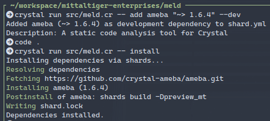

UNDER DEVELOPMENT & EXPERIMENTAL - USE AT YOUR OWN RISK

# meld
Crystal Lang Package Manager - A modern, user-friendly package manager for Crystal projects.

## Features

- **Simple Commands**: Easy-to-remember commands for all package management tasks
- **GitHub Integration**: Automatic repository detection for popular Crystal shards
- **Development Dependencies**: Separate handling of development and production dependencies
- **Search Functionality**: Built-in search for discovering Crystal shards
- **Project Initialization**: Quick project setup with sensible defaults
- **Command Execution**: Run commands in your project context

## Installation

### From Source
```bash
git clone https://github.com/cmittal790/meld.git
cd meld
shards install
crystal build src/meld.cr -o bin/meld
```

### Add to PATH
```bash
# Add the bin directory to your PATH
export PATH=$PATH:/path/to/meld/bin
```

## Usage

### Project Initialization
Start a new Crystal project with a properly configured `shard.yml`:

```bash
meld init
```

This creates a `shard.yml` file with:
- Project metadata template
- Crystal version requirement
- License and author fields
- Main executable target

### Adding Dependencies

**Add latest version of a shard:**
```bash
meld add kemal
```

**Add with specific version constraint:**
```bash
meld add kemal "~> 1.0.0"
```

**Add as development dependency:**
```bash
meld add spec --dev
meld add ameba "~> 1.4.0" --dev
```

**Add from specific GitHub repository:**
```bash
meld add my_shard "github:username/repository"
```

**Add from Git URL:**
```bash
meld add my_shard "git:https://github.com/username/repo.git"
```

### Dependency Management

**Install all dependencies:**
```bash
meld install
```

**Update all dependencies:**
```bash
meld update
```

**Update specific dependency:**
```bash
meld update kemal
```

### Searching for Shards

**Search for shards by keyword:**
```bash
meld search "web framework"
meld search database
meld search testing
```

### Command Execution

**Run tests:**
```bash
meld exec "crystal spec"
```

**Build your project:**
```bash
meld exec "crystal build src/my_project.cr"
```

**Run your application:**
```bash
meld exec "crystal run src/my_project.cr"
```

**Run code analysis:**
```bash
meld exec "ameba"
```

### Binstubs

**Generate executable wrappers:**
```bash
meld binstubs kemal
```

## Common Workflows

### Web Application Setup
```bash
# Initialize project
meld init

# Add web framework and dependencies
meld add kemal "~> 1.0.0"
meld add pg
meld add jwt

# Add development tools
meld add spec --dev
meld add ameba "~> 1.4.0" --dev
meld add webmock --dev

# Install everything
meld install
```

### Database Project Setup
```bash
# Initialize project
meld init

# Add ORM and database driver
meld add jennifer
meld add pg

# Add development dependencies
meld add spec --dev
meld install
```

### Testing Workflow
```bash
# Run tests
meld exec "crystal spec"

# Run static analysis
meld exec "ameba"

# Run specific test file
meld exec "crystal spec spec/models/user_spec.cr"
```

## Supported Shards

Meld includes built-in support for popular Crystal shards:

**Web Frameworks:**
- kemal - Lightning fast web framework
- lucky - Full-featured web framework
- amber - Productive web framework
- marten - Pragmatic web framework

**Database:**
- pg - PostgreSQL driver
- mysql - MySQL connector
- sqlite3 - SQLite3 bindings
- redis - Redis client

**ORMs:**
- jennifer - Active Record pattern
- clear - Advanced PostgreSQL ORM
- granite - Simple ORM

**Development Tools:**
- spec - Testing framework
- ameba - Static code analysis
- webmock - HTTP mocking

**Utilities:**
- crest - HTTP client
- jwt - JWT implementation
- colorize - Terminal colors
- hardware - System information

## Commands Reference

| Command | Description | Example |
|---------|-------------|---------|
| `init` | Initialize new project | `meld init` |
| `add <shard> [version] [--dev]` | Add dependency | `meld add kemal "~> 1.0.0"` |
| `search <query>` | Search for shards | `meld search "web framework"` |
| `install` | Install dependencies | `meld install` |
| `update [shard]` | Update dependencies | `meld update kemal` |
| `exec <command>` | Execute command | `meld exec "crystal spec"` |
| `binstubs <shard>` | Generate binstubs | `meld binstubs kemal` |
| `help` | Show help | `meld help` |

## Development

### Prerequisites
- Crystal >= 1.0.0
- Shards package manager

### Setup
```bash
# Clone the repository
git clone https://github.com/cmittal790/meld.git
cd meld

# Install dependencies
shards install

# Build the project
crystal build src/meld.cr -o bin/meld

# Run tests
crystal spec
```

### Project Structure
```
src/
├── meld.cr          # Main entry point
├── meld/
│   ├── cli.cr       # Command-line interface
│   └── project.cr   # Project management logic
spec/                # Test files
shard.yml           # Project dependencies
```

### Running Tests
```bash
# Run all tests
crystal spec

# Run specific test file
crystal spec spec/meld/cli_spec.cr

# Run with coverage
crystal spec --coverage
```

## Contributing

1. Fork it (<https://github.com/cmittal790/meld/fork>)
2. Create your feature branch (`git checkout -b my-new-feature`)
3. Commit your changes (`git commit -am 'Add some feature'`)
4. Push to the branch (`git push origin my-new-feature`)
5. Create a new Pull Request

### Contribution Guidelines

- Write tests for new features
- Follow Crystal coding conventions
- Update documentation for new commands
- Add new shards to the local database when appropriate
- Ensure backwards compatibility

## License

This project is licensed under the AGPL-3 License. See LICENSE file for details.

## Contributors

- [Chetan Mittal](https://github.com/cmittal790) - creator and maintainer

## Roadmap

- [ ] Remove packages (prunes from ```lib``` folder too) e.g. ```meld remove kemal```
- [ ] Meld self installer and updater e.g. ```meld self install```, ```meld self update```
- [ ] Global package install e.g. ```meld install morten```
- [ ] Package registry integration
- [ ] Dependency resolution improvements
- [ ] Configuration file support
- [ ] Plugin system
- [ ] Advanced search filters
- [ ] Dependency graph visualization

